# 🚀 CodeBid

**CodeBid** is a dynamic Flutter application designed to bridge the gap between users who have coding tasks (Requesters) and skilled developers ready to solve them (Solvers). By leveraging a seamless bidding system, CodeBid makes it easier than ever to outsource tech tasks or find exciting new freelance opportunities.

Built with **Flutter**, **GetX** for state management, and **Firebase** as a robust backend.

---

## ✨ Key Features
* 🔐 **Secure Authentication**: Sign Up and Login powered by Firebase Auth.
* 👥 **Role-Based Experience**: Dedicated dashboards and workflows for Requesters and Solvers.
* ⚡ **Real-Time Bidding System**: Solvers can seamlessly browse tasks and place competitive bids.
* 📊 **Task Management**: Requesters can post, monitor, and manage the bids received on their tasks.
* 📱 **Responsive & Modern UI**: A sleek, cross-platform interface built entirely in Flutter.
* 🗂️ **Reactive State Management**: Highly efficient UI updates handled smoothly via GetX.

---

## 🌟 App Roles & Features

CodeBid provides a tailored experience depending on the role you choose upon signing up. 

### 1. Unified Onboarding
Both Requesters and Solvers go through a smooth onboarding flow to get started.

<div align="center">
  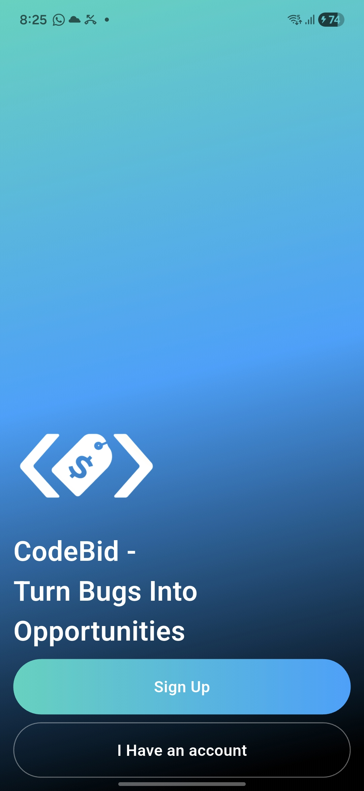
  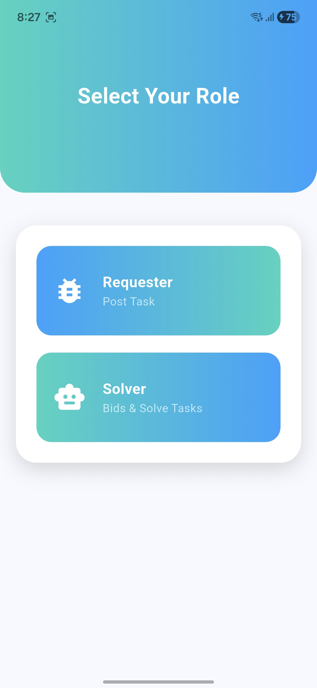
  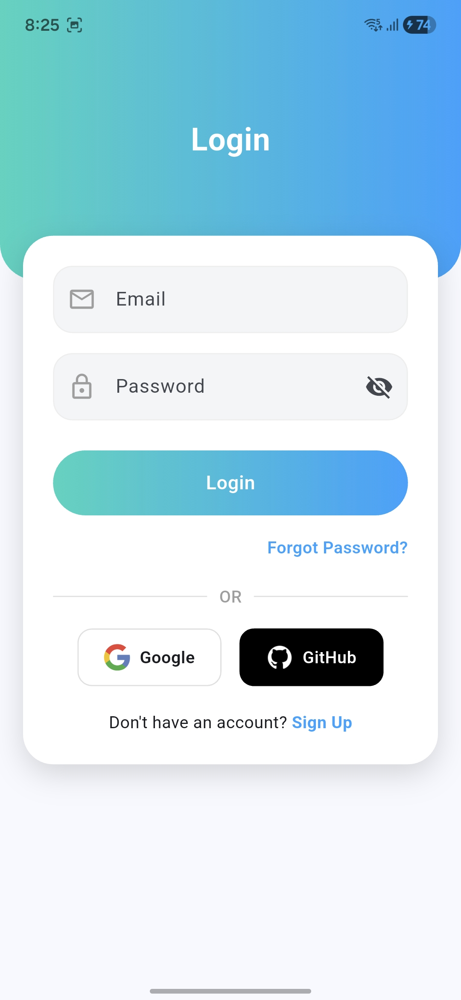
  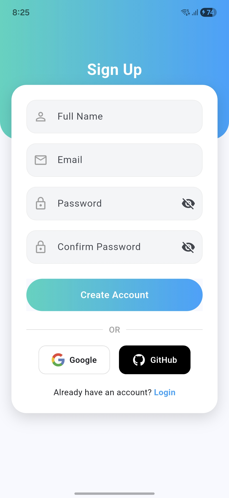
</div>

* **Welcome Screen**: A friendly greeting introducing you to CodeBid.
* **Role Selection**: Choose whether you need help (`Requester`) or want to provide solutions (`Solver`).
* **Authentication**: Secure Login and Sign-Up integrated with Firebase.

---

### 🧑‍💼 For Requesters (Post Tasks & Manage)

As a Requester, your goal is to get your tasks solved efficiently. Here's how to use the app:

**Steps to follow:**
1. **Home Dashboard**: View an overview of your active and past tasks.
2. **Create Task**: Easily post a new coding problem. Detail what you need, set a budget or timeframe, and publish it to the solver community.
3. **Review & Approve Bids**: Once Solvers start bidding, review their proposals on your task and approve the best fit to kick-start the work.

<div align="center">
  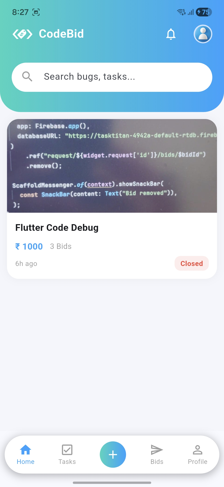
  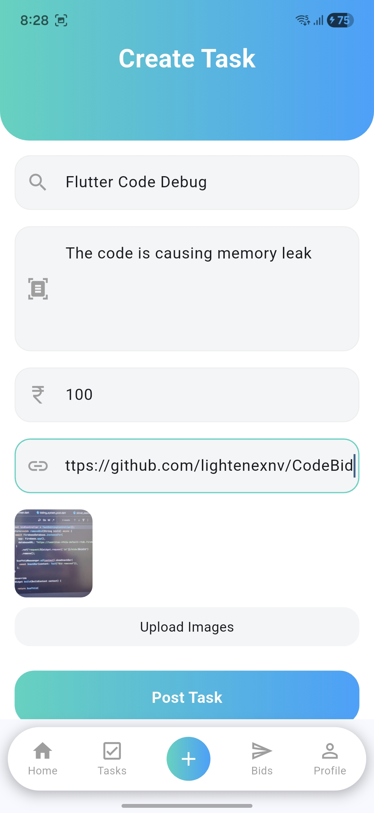
  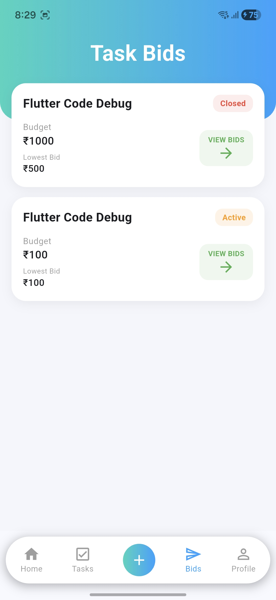
  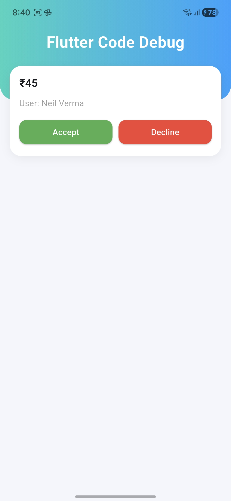
</div>

*Images above: Requester Home Screen, Create Task, Review Bids, and Approve Bid screens.*

---

### 💻 For Solvers (Find Work & Bid)

As a Solver, you can browse available tasks and bid on the ones you are qualified to complete.

**Steps to follow:**
1. **Home Dashboard**: Browse a live feed of tasks posted by Requesters.
2. **View & Place Bid**: Tap on a task that interests you (`Place Bid Screen`). Read the details and submit your competitive bid (`Place Bid on Task`).
3. **Manage Bids**: Track all the bids you’ve placed in your dedicated bidding dashboard (`All Bidding Made by Solver`).
4. **Profile Management**: Maintain your profile to look professional to potential Requesters.

<div align="center">
  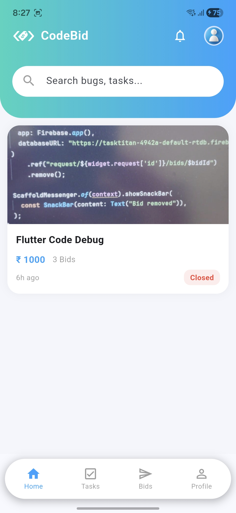
  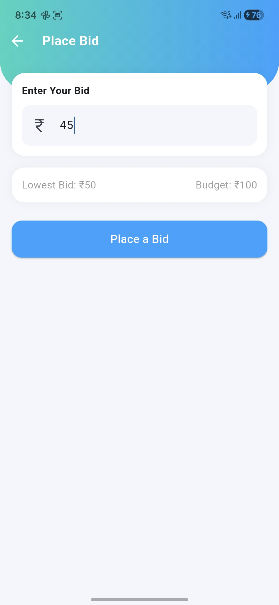
  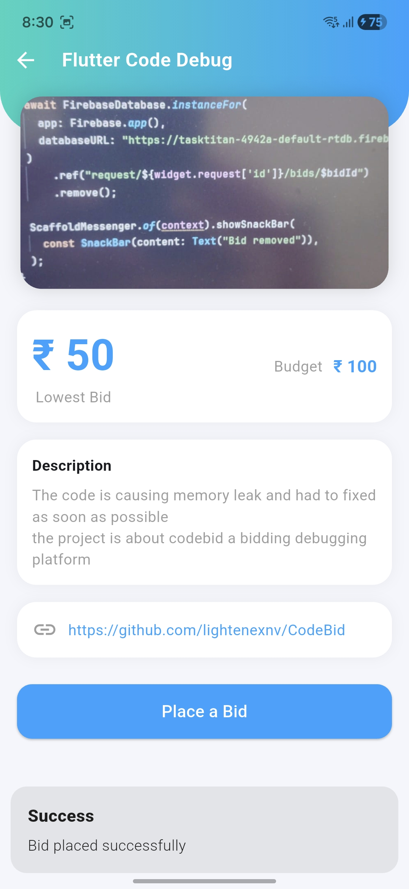
  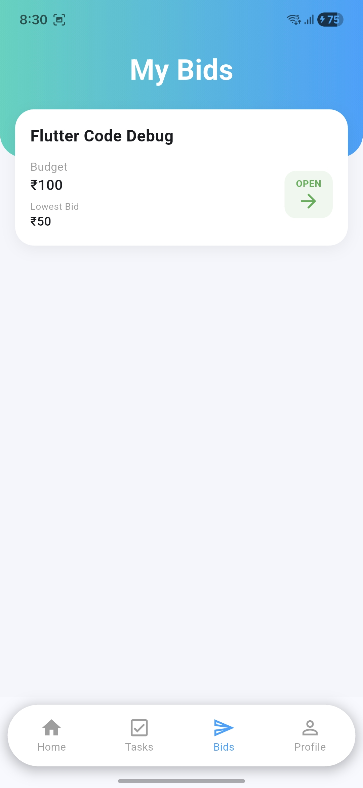
</div>

*Images above (left to right): Solver Home Screen, Task Details (Place Bid Screen), Bidding form, and All Bids History.*

#### 👤 Solver Profile
A Profile Page Displaying tasks uploade by the requester and tasks or bidding won by the solver which displayes as achievement and can be used to increase the trust rate for requester to accept a bid.
<br/>
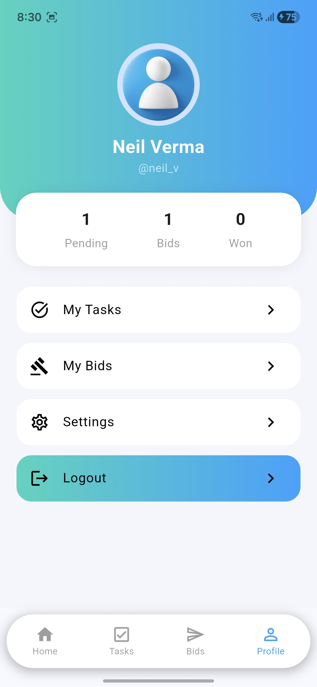

---

## 🛠️ Technology Stack
* **Frontend**: [Flutter](https://flutter.dev/)
* **State Management**: [GetX](https://pub.dev/packages/get)
* **Backend**: [Firebase](https://firebase.google.com/) (Auth, Cloud Firestore, Realtime Database, Cloud Storage)

---

## 🏗️ Architecture
The CodeBid app follows a clean and modular folder structure utilizing the MVC/MVVM principles strongly enforced by **GetX**.
* **Controllers**: Business logic is decoupled from the UI. Features like user authentication, task fetching, and bid posting are handled by specific GetX controllers (e.g., `AuthController`, `TaskController`).
* **Views**: UI components and screens built with Flutter widgets, observing the GetX state to perform minimal, targeted rebuilds.
* **Models**: Dart data classes mapped from Firebase NoSQL schema to represent `User`, `Task`, and `Bid` objects cleanly.
* **Services/Repositories**: Encapsulated API calls to Firestore and Firebase Auth, ensuring scalability and easy maintenance.

---

## 🚀 Future Improvements
To take CodeBid to the next level, the following features are planned for upcoming iterations:
- [ ] 🔔 **Push Notifications**: Notify Requesters when a new bid is placed, and alert Solvers when their bid is approved.
- [ ] 💬 **In-App Messaging**: Real-time chat system to allow Requesters and Solvers to discuss project details directly.
- [ ] 💳 **Payment Integration**: Incorporate an escrow payment system (Stripe / Razorpay) for secure milestone releases.
- [ ] ⭐ **Rating & Review System**: Allow users to rate their experiences, building trust and reputation profiles.
- [ ] 🔍 **Advanced Filtering**: Search and sort tasks / bids by technology stacks, complexity, or budget tiers.

---

## 🏁 Getting Started (Local Development)

To run the app locally, follow these steps:

1. Clone the repository:
   ```bash
   git clone https://github.com/lightenexnv/CodeBid.git
   ```
2. Navigate into the directory:
   ```bash
   cd CodeBid
   ```
3. Install dependencies:
   ```bash
   flutter pub get
   ```
4. Run the app:
   ```bash
   flutter run
   ```

*(Note: Make sure your `lib/firebase_options.dart` is correctly configured for your Firebase project before running.)*
